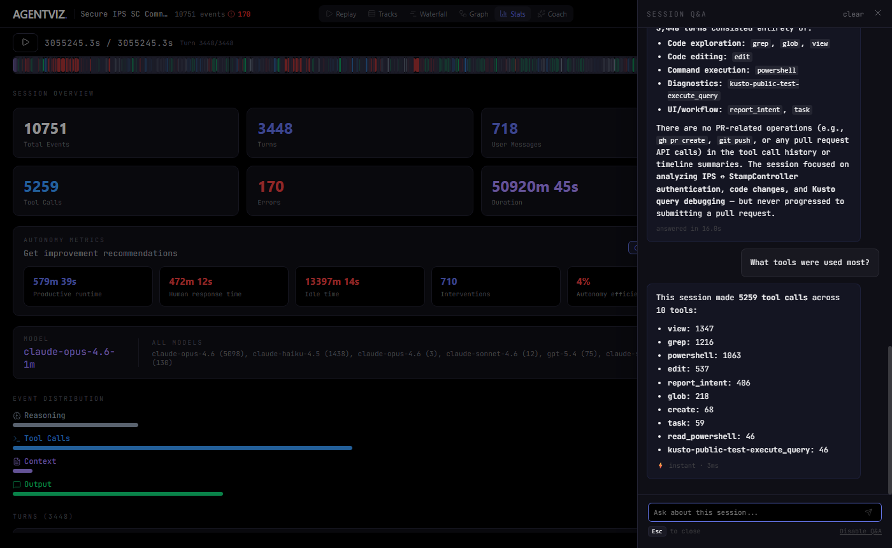

# feat: Improve Session Q&A performance, UX, and answer quality

## Summary

Enhances the Session Q&A drawer with better performance, richer instant answers, persistent history, and polished UX -- all without adding any new dependencies.

## Screenshots

### Instant answer with timing and markdown list rendering

### Empty drawer with suggested chips

### User messages with clickable turn references

## Key Changes

### Performance

- **Expanded instant classifier** (9 → 20 patterns): Files, commands, turn ranges, first/last turn, session format, user messages, event count, specific tool detail, file detail, tool usage. ~45% of questions now answer in <5ms.
- **Paraphrase-aware answer caching**: Model answers cached by question fingerprint in localStorage. Survives page reloads. Rephrased questions get the same cached answer in <1ms.
- **Session index with tool index + chunk summaries**: Built at drawer open (<100ms), cached in localStorage. Gives the model a timeline skeleton of the entire session AND targeted tool call evidence for domain questions.
- **Question-aware context windowing**: Error questions get error events, file questions get file operations, turn questions get turn events. Smaller, more relevant context for faster model responses.
- **Domain keyword search**: Extract key terms from questions and search the tool index for matching events. Actual tool call content (e.g., KQL query text) is sent to the model as primary evidence.
- **Context size cap**: 32K chars max prompt, 50 event cap per turn range.
- **60s timeout** (up from 30s) with graceful truncation (partial answer preserved with note).

### UX

- **Answer timing**: "⚡ instant · 1ms", "↻ cached answer · 0ms", or "answered in 12.3s".
- **Persistent Q&A history**: localStorage by session key. Navigate away and back, conversation restored.
- **Green thinking bubble**: Animated pulsing dots with rotating labels while waiting for first model token.
- **Progressive streaming**: Full SDK responses split into word-sized tokens for visible streaming.
- **Stop button**: Replaces Send during streaming. Aborts request, keeps partial answer.
- **Markdown rendering**: Lists (bullet/numbered), tables (thead/tbody), headers, bold, `code`, and clickable `[Turn N]` references -- all inline, no dependencies.
- **Keyboard**: Up-arrow recalls last question. Escape closes drawer.
- **Scroll to bottom**: Reopening drawer jumps to latest message.

### Answer quality

- **Improved system prompt**: Explicit rules for markdown, [Turn N] linking, 300-word limit. "The provided context IS the data" -- no hallucinated store references.
- **Clean tool input extraction**: Actual query/command/file_path text in snippets instead of raw JSON.
- **Prioritized evidence**: Relevant tool call events placed first in model prompt with prominent label.
- **Session rotation**: After 6 model questions, inject compact recap of last 4 Q&A pairs.
- **Expanded stop words**: Filter common verbs so keyword search targets domain terms.

## New instant answer patterns

| Pattern | Example | Response |
|---------|---------|----------|
| files | "What files were edited?" | <5ms |
| commands | "What commands were run?" | <5ms |
| turnRange | "What happened in turns 0-5?" | <5ms |
| firstTurn | "What was the first thing done?" | <5ms |
| lastTurn | "What was the last turn?" | <5ms |
| format | "What format is this session?" | <1ms |
| userMsgs | "What did the user ask?" | <5ms |
| events | "How many events?" | <1ms |
| toolDetail | "How many times was bash used?" | <5ms |
| fileDetail | "What changes were made to auth.ts?" | <5ms |
| toolUsage | "How was powershell used?" | <5ms |

## Testing

- **325 unit tests passing** (18 new classifier tests)
- **Build clean** (Vite production build)
- **Verified with Playwright** on 97MB session (3,448 turns, 5,259 tool calls)

## Files changed

| File | Change |
|------|--------|
| `src/hooks/useQA.js` | Persistent history, answer caching, session index, session rotation, timing, progress, stop |
| `src/lib/qaClassifier.js` | 11 new patterns, fingerprinting, context windowing, session index, tool index, chunk summaries |
| `src/lib/qaAgent.js` | System prompt, context formatting, word-split streaming, prompt cap |
| `src/components/QADrawer.jsx` | Turn linking, markdown rendering, thinking bubble, timing, stop button, keyboard |
| `src/__tests__/qaClassifier.test.js` | 18 new tests |
| `server.js` | Debug log cleanup |

## Non-goals

- No new npm dependencies
- No changes to drawer UI form factor (keeps slide-over design)
- No SQLite or lunr.js
