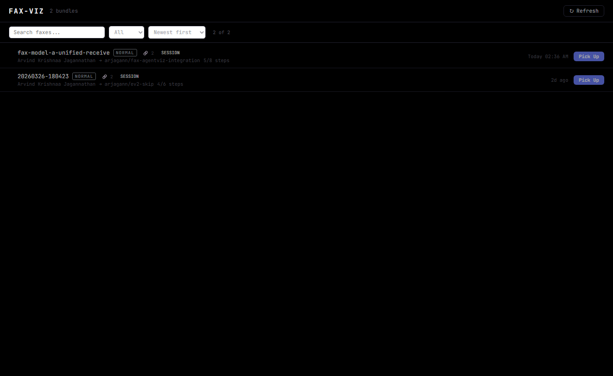
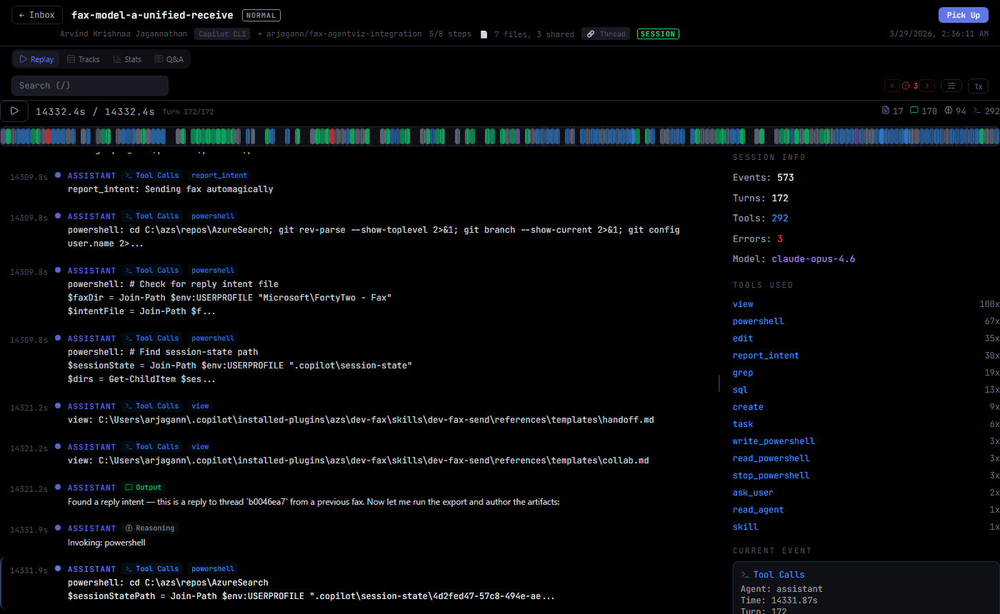
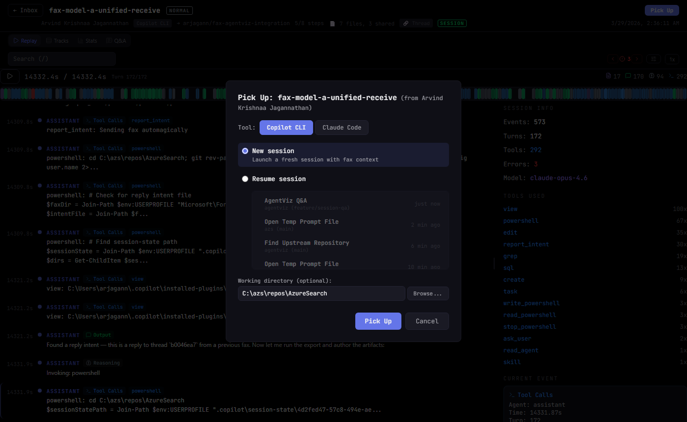
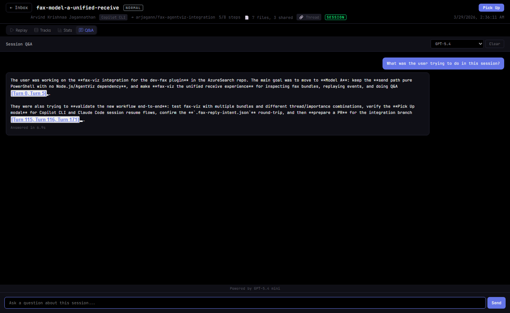

<div align="center">

# FAX-VIZ

**Browse, review, and pick up fax context bundles.**

A standalone web viewer for fax context bundles shared between AI agent sessions. Browse your inbox, inspect session replays, ask questions with AI-powered Q&A, and pick up bundles to continue work.


<br />



*Browse fax bundles with importance badges, thread grouping, and unread tracking.*

</div>

---

## Why FAX-VIZ?

When AI agents hand off context between sessions, the result is a fax context bundle: a directory of markdown files, session events, and metadata. FAX-VIZ gives you a visual way to:

- **Browse** incoming fax bundles in an inbox with search, importance filtering, and thread grouping
- **Inspect** session replays, tracks, and stats from any fax bundle
- **Ask questions** about session data and fax content with AI-powered Q&A
- **Pick up** a fax to continue work in Copilot CLI or Claude Code with full context

## Quick Start

```bash
node bin/fax-viz.js --fax-dir /path/to/fax/bundles
```

Opens at [localhost:4243](http://localhost:4243). Use `--open <name>` to jump directly to a specific fax, or `--no-open` to suppress the browser.

### Options

```
--fax-dir <path>        Path to directory containing fax bundles (required)
--threads-file <path>   Path to threads.json for thread store integration
--open <name>           Open browser directly to a specific fax bundle
--no-open               Don't open browser automatically
```

## Inbox View

Browse all fax bundles with search, filtering by importance (Urgent / High / Normal), and sorting by date, importance, or sender. Unread badges, thread counts, and session indicators help you triage quickly.

<div align="center">

</div>

## Observe View

Click any fax to open it in the observe view. The metadata header shows importance, progress, sender, artifacts, and thread info. Below it, tabbed views are available: Replay, Tracks, Stats, and Q&A.

Error navigation (E / Shift+E), track filters, playback speed control, and keyboard shortcuts work across all views.

<div align="center">

</div>

## Pick Up Flow

Click **Pick Up** to launch a new session that continues the fax's work. Choose between Copilot CLI and Claude Code, start a new session or resume an existing one, and specify a working directory.

The bootstrap prompt from the fax bundle is automatically injected into the new session, giving the agent full context about the prior work, decisions, and next steps.

<div align="center">

</div>

## Session Q&A

The Q&A tab lets you ask natural-language questions about the session data. Fax bundle markdown files (handoff.md, analysis.md, decisions.md, collab.md) are automatically injected as additional context, so the model can answer questions about both the session trace and the fax content.

<div align="center">

</div>

## Fax Bundle Structure

Each fax bundle is a directory containing:

| File | Purpose |
|------|---------|
| `events.jsonl` | Session trace (Claude Code or Copilot CLI format) |
| `handoff.md` | Summary of work done and context for the recipient |
| `analysis.md` | Technical analysis and decisions |
| `decisions.md` | Key decisions and rationale |
| `collab.md` | Collaboration notes and next steps |
| `bootstrap-prompt.txt` | Pre-built prompt for the Pick Up flow |
| `.fax-reply-intent.json` | Thread metadata for reply tracking |

## API Endpoints

| Endpoint | Method | Description |
|----------|--------|-------------|
| `/api/faxes` | GET | List all fax bundles |
| `/api/fax/:id/events` | GET | Session events for a bundle |
| `/api/fax/:id/manifest` | GET | Bundle metadata (sender, importance, progress) |
| `/api/fax/:id/pickup` | POST | Extract bootstrap prompt for session launch |
| `/api/launch-session` | POST | Launch Copilot CLI or Claude Code with fax context |
| `/api/copilot-sessions` | GET | List available sessions for resume |
| `/api/browse-folder` | POST | Native OS folder picker dialog |
| `/api/fax-read-status` | GET/POST | Read/unread tracking |
| `/api/qa` | POST | Q&A with fax context injection |
| `/api/version` | GET | Server version and commit info |

## Distribution

FAX-VIZ can be distributed as a pre-built bundle (no npm/npx required):

```bash
# Build the bundle locally
npm run build:fax-viz-bundle

# Run from bundle (only Node.js 18+ required)
node build/fax-viz-server.mjs --fax-dir /path/to/fax/bundles
```

Pre-built bundles are published as GitHub Release assets on every version tag. Download `fax-viz-bundle.zip` from the [Releases page](https://github.com/arv100kri/agentviz/releases).

The bundle contains `fax-viz-server.mjs` (~186 KB) and `dist-fax-viz/` (~355 KB). Q&A features require `@github/copilot-sdk` in the Node module path.

## Keyboard Shortcuts

| Key | Action |
|-----|--------|
| `Space` | Play / Pause |
| `Left` / `Right` | Seek 2 seconds |
| `1` / `2` / `3` / `4` | Switch view (Replay / Tracks / Stats / Q&A) |
| `/` | Focus search |
| `E` / `Shift+E` | Next / Previous error |
| `Escape` | Back to inbox |

## Architecture

```
src/
  fax-viz/
    FaxApp.jsx             # Main app with inbox and observe views
    main.jsx               # React entry point with error boundary
    components/
      FaxInboxView.jsx     # Fax bundle inbox with Pick Up buttons
      FaxObserveShell.jsx  # Observe view with header and session replay
      FaxQADrawer.jsx      # Q&A sidebar for fax context
      PickUpModal.jsx      # Pick Up modal with tool selector and session picker
    hooks/
      useFaxDiscovery.js   # Polls /api/faxes for bundle list
      useFaxReadStatus.js  # Read/unread status tracking
    lib/
      faxConstants.js      # Port, importance colors, sort options
      faxReplyIntent.js    # Reply intent file read/write
      faxTypes.ts          # TypeScript types for fax manifests
      threadStore.js       # Thread metadata store
  hooks/
    usePlayback.js         # Play/pause, speed, seek state machine
    useSearch.js           # Debounced full-text search with match highlighting
    useKeyboardShortcuts.js # Centralized keyboard handler
    usePersistentState.js  # localStorage-backed useState with debounced writes
    useSessionQA.js        # Session Q&A conversation state and streaming
  lib/
    theme.js               # Design tokens (true black base, blue/purple/green accents)
    parseSession.ts        # Auto-detect format router
    parser.ts              # Claude Code JSONL parser
    copilotCliParser.ts    # Copilot CLI JSONL parser
    session.ts             # Pure helpers: getSessionTotal, buildFilteredEventEntries
    sessionTypes.ts        # TypeScript type definitions
    sessionParsing.ts      # Session parsing utilities
    replayLayout.js        # Virtualized windowing for large sessions
    diffUtils.js           # Diff detection and Myers line diff algorithm
    pricing.js             # Claude model pricing table and cost estimation
    dataInspector.js       # Payload summary and preview helpers
    formatTime.js          # Duration and date formatting utilities
    playbackUtils.js       # Playback state helpers
    qaClassifier.js        # Question classification for Q&A routing
    autonomyMetrics.js     # Session autonomy scoring
    sessionQA.js           # Q&A helpers: context building, routing, chunk scoring
    sessionQAServer.js     # Q&A server utilities (precompute, cache, history)
    sessionQAPipeline.js   # Q&A pipeline: routing, fact store, model calling
    sessionQAEndpoints.js  # Q&A endpoint handlers: readBody, cache, SSE
    sessionQAFactStore.js  # SQLite fact store for deterministic Q&A lookups
    sessionSearchIndex.js  # lunr.js full-text search index
  components/
    ReplayView.jsx         # Windowed event stream + inspector sidebar
    TracksView.jsx         # DAW-style multi-track timeline
    StatsView.jsx          # Aggregate metrics and tool ranking
    QAView.jsx             # AI-powered Session Q&A panel
    Timeline.jsx           # Scrubable playback bar with event markers
    DiffViewer.jsx         # Inline unified diff for file edits
    DataInspector.jsx      # Readable payload inspector with copy support
    SyntaxHighlight.jsx    # Lightweight code syntax coloring
    ResizablePanel.jsx     # Drag-to-resize split panel utility
    ErrorBoundary.jsx      # React error boundary
    Icon.jsx               # Lucide icon wrapper
    ui/
      ToolbarButton.jsx    # Toolbar button component
bin/
  fax-viz.js               # CLI entry point: starts server, opens browser
fax-viz-server.js          # HTTP server: fax discovery, session events, Q&A
esbuild.fax-viz.mjs        # Bundle builder for standalone distribution
```

## Development

```bash
npm run dev:fax-viz        # Vite dev server on port 3001
node bin/fax-viz.js --fax-dir <path>  # API backend on port 4243
npm run build:fax-viz      # Production build to dist-fax-viz/
npm run build:fax-viz-bundle  # Standalone distributable bundle
npm test                   # Unit tests via Vitest
npm run test:e2e           # Playwright E2E tests
npm run typecheck          # TypeScript checks
```

> **Full dev setup requires both servers.** `npm run dev:fax-viz` starts the Vite frontend; `node bin/fax-viz.js --fax-dir <path>` starts the API backend. Vite proxies `/api/*` to the backend automatically.

### Design System

True black base (`#000000`) with blue, purple, and green accents. All colors are defined as design tokens in `src/lib/theme.js`. JetBrains Mono throughout. No CSS framework; all styles are inline.

## Supported Formats

| Format | File type | Auto-detected by |
|--------|-----------|-----------------|
| Claude Code | `.jsonl` from `~/.claude/projects/` | Default fallback |
| Copilot CLI | `.jsonl` event traces | `session.start` with `producer: "copilot-agent"` |

## License

MIT
